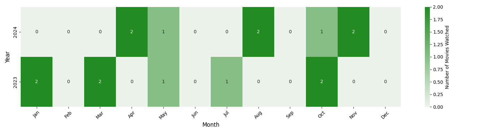

---
layout: default
published : true
title: to be added
permalink: /media/rating/  
hidden : true
--- 

### A simple heatmap showing how many movies I saw 

<h3> Head over to </h3>
- [Watch List for 2024](#WatchList2024)
- [Watch List for 2023](#WatchList2023)
- [Watch List for 2022 and 2021, all mixed up](#WatchListOldBollywood)
- [Watch List for older Hollywood movies](#WatchListOldHollywood)

### Pineapple Express 2007
- **Rating**: ★★★★☆ 9
- **Genre**: nonsensical
- **Date** : 4 November 2024
- **Brief Review**: 
        Plot holes, but okay fun to watch
Typical Seth Rogen, on similar topics, still fun

### Get Hard 2015
- **Rating**: ★★★☆☆ 7
- **Genre**: nonsensical
- **Date** : 4 November 2024
- **Brief Review**: 
        Stereotypical, fun, story is not that captivating
Kevin Hart being a token black guy

### White Chicks 2004
- **Rating**: ★★★★☆ 8
- **Genre**: Comedy
- **Date** : 22 October 2024
- **Brief Review**: 
        Amazing, funny, stereotypical

### Khosla ka Ghosla 2006
- **Rating**: ★★★★☆ 9
- **Genre**: Coming of Age
- **Date** : 1 August 2024
- **Brief Review**: 
        Amazing, feel good melodrama, coming of age movie
Must watch with family, loved the cinematic shot at 2:01:41

### Hum Tum 2004
- **Rating**: ★★☆☆☆ 4
- **Genre**: Drama
- **Date** : 1 August 2024
- **Brief Review**: 
        Meh, one should move on pretty early on
Predictable end, songs make the story seem rushed, else good/bearable

### Delhi Belly 2011
- **Rating**: ★★★☆☆ 7
- **Genre**: nonsensical
- **Date** : 5 May 2024
- **Brief Review**: 
        Movie does not make sense, but is fun

### Bend It Like Beckham 2002 
- **Rating**: ★★★★☆ 9
- **Genre**: Coming of Age
- **Date** : 18 April 2024
- **Brief Review**: 
        Amazing, fun, feels very indian and open at the same time, has a bit of cliche moments, 
but these are turned happening and exciting. Great watch.

### All Quiet on the Western Front 
- **Rating**: ★★★★☆ 8
- **Genre**: War
- **Date** : 17 April 2024
- **Brief Review**: 
        Visually strong, how easily can lives be lost

### Fatherhood Kevin Hart
- **Rating**: ★★★☆☆ 7
- **Genre**: Documentary
- **Date** : 31 October 2023
- **Brief Review**: 
        Cliche, theek hai tho
        Powerful story 

### Uncharted 2022
- **Rating**: ★★☆☆☆ 4
- **Genre**: Action
- **Date** : 30 October 2023
- **Brief Review**: 
        Nothing new, very cliche
        Waste of time

### A Brilliant Young Mind
- **Rating**: ★★★★☆ 8
- **Genre**: Documentary
- **Date** : 17 July 2023
- **Brief Review**: 
        Idk mixed not boring tho, lacks conclusion

### The Boy Who Harnessed The Wind
- **Rating**: ★★★☆☆ 7
- **Genre**: Drama
- **Date** : 5 May 2023
- **Brief Review**: 
        Great movie, talks about parenting  

### The Great Hack 2019
- **Rating**: ★☆☆☆☆ 3
- **Genre**: Drama
- **Date** : 23 March 2023
- **Brief Review**: 
seems like a movie for paraniods, more like a campaign on its own

### Wakanda 2022
- **Rating**: ★☆☆☆☆ 2
- **Genre**: Documentary
- **Date** : 11 March 2023
- **Brief Review**: 
        Have I lost all appreciation of art
No fight sequence alongside very poor transitions, Not enough lighting at times
The art style feels a bit off, especially the goggles
2065 byte encryption bro wtf, Alse there is no such thing as euler angles
The Talokan chant sucks, sounds like Taloker bakery
Tf, ri/rio mentions she built her first machine when she was 3
Wakanda me IIT nai hai kya 💀

### The Theory of Everything
- **Rating**: ★★★★☆ 8
- **Genre**: Documentary
- **Date** : 29 January 2023
- **Brief Review**: 
        Beautiful, wish Jane had more appreciation

### First Man 2018
- **Rating**: ★★★☆☆ 7
- **Genre**: Sci-Fi
- **Date** : 27 January 2023
- **Brief Review**: 
        Great watch, has Ryan Gosling as well

## Bollywood Section

### Newton
- **Rating**: ☆☆☆☆☆ 0
- **Genre**: Drama
- **Date** : 
- **Brief Review**: ok-ok

### Dream Girl
- **Rating**: ☆☆☆☆☆ 0
- **Genre**: nonsensical
- **Date** : 
- **Brief Review**: timepass comedy

### Super 30
- **Rating**: ☆☆☆☆☆ 0
- **Genre**: Documentary
- **Date** : 
- **Brief Review**: feel good jee era movie

### Midnight runners
- **Rating**: ☆☆☆☆☆ 0
- **Genre**: Drama
- **Date** : 
- **Brief Review**: definitely not comedy, more like social issues pe movie

### Shershaah
- **Rating**: ☆☆☆☆☆ 0
- **Genre**: Documentary
- **Date** : 
- **Brief Review**: meh, felt a bit too off

### Udaan 2010
- **Rating**: ☆☆☆☆☆ 0
- **Genre**: Drama
- **Date** : 
- **Brief Review**: bhai kya tha ye, kyu dekha

### Masaan 2015
- **Rating**: ☆☆☆☆☆ 0
- **Genre**: Drama
- **Date** : 
- **Brief Review**: saddening to watch

### Tanshekt Films
- **Rating**: ☆☆☆☆☆ 0
- **Genre**: Documentary
- **Date** : 
- **Brief Review**: kya conclusion tha iska, very confusing
        felt more a propoganda film

### I'm not done yet Kapil Sharma
- **Rating**: ☆☆☆☆☆ 0
- **Genre**: Documentary
- **Date** : 
- **Brief Review**: ye mai kyu dekha? Felt like a waste of time

### Udham Singh
- **Rating**: ☆☆☆☆☆ 0
- **Genre**: Documentary
- **Date** : 
- **Brief Review**: kaafi touching movie, affected the way i think about revolution and stuff like that

### Why Cheat India
- **Rating**: ☆☆☆☆☆ 0
- **Genre**: Drama
- **Date** : 
- **Brief Review**: sirf starting ka 10-15mins good, baaki bekar, nice ending tho

### The Big Bull Abhishek Bachan
- **Rating**: ☆☆☆☆☆ 0
- **Genre**: Documentary
- **Date** : 
- **Brief Review**: Alag perspective from the series, good for talkshow kinda ppl

### Om Shanti Om
- **Rating**: ☆☆☆☆☆ 0
- **Genre**: Drama
- **Date** : 
- **Brief Review**: might be a timeless classic, strong plot and can watch with any crowd
        loved the songs, and how perfectly they felt with the plot

## Hollywood Section

### Good Will Hunting
- **Rating**: ☆☆☆☆☆ 0
- **Genre**: Drama
- **Date** : 
- **Brief Review**: ok-ok

### The 40-Year-Old Virgin
- **Rating**: ☆☆☆☆☆ 0
- **Genre**: Comedy
- **Date** : 
- **Brief Review**: funny timepass, nothing more. Plot isn't that strong maybe just fit enough for a watch with roomates

### The man who knew infinty
- **Rating**: ☆☆☆☆☆ 0
- **Genre**: Documentary
- **Date** : 
- **Brief Review**: Great storytelling, got me hooked. Amazing casting

### Love Hard
- **Rating**: ☆☆☆☆☆ 0
- **Genre**: Drama
- **Date** : 
- **Brief Review**: idk what to say, predictable. Saw it just for Darren Barnet

### Free Guy
- **Rating**: ☆☆☆☆☆ 0
- **Genre**: nonsensical
- **Date** : 
- **Brief Review**: ok-ok, not much of a plot

### Inglourious Basterds
- **Rating**: ☆☆☆☆☆ 0
- **Genre**: Drama
- **Date** : 
- **Brief Review**: ajeeb uniquely weird, quite special for me as I watched this along with a bunch of strangers on the discord server of r/IndiaSocial, which seemed a pretty chill place

### Shang Chi
- **Rating**: ☆☆☆☆☆ 0
- **Genre**: Sci-Fi
- **Date** : 
- **Brief Review**: Great soundtrack, cannot say the same for the plot

### Venom 2
- **Rating**: ☆☆☆☆☆ 0
- **Genre**: Sci-Fi
- **Date** : 
- **Brief Review**: Noice, just like the previous iteration this one is better enjoyed with the Hindi soundtrack

### French Dispatch
- **Rating**: ☆☆☆☆☆ 0
- **Genre**: Drama
- **Date** : 
- **Brief Review**: art movie sorta, didn't like it tbh. Probably the only Timothee Chalamet I'll ever see

### Hacksaw Ridge
- **Rating**: ☆☆☆☆☆ 0
- **Genre**: War
- **Date** : 
- **Brief Review**: confused about it, but it seems I really like war themed movies

### The Dictator
- **Rating**: ☆☆☆☆☆ 0
- **Genre**: Comedy
- **Date** : 
- **Brief Review**: funny but weird, would only recommed to watch once with friends, the jokes get repetitive soon

### King Richard - Will Smith
- **Rating**: ☆☆☆☆☆ 0
- **Genre**: Documentary
- **Date** : 
- **Brief Review**: 
        nice, feel good. Feels like Dangal but for Hollywood

### Ford vs Ferrari
- **Rating**: ★★★★☆ 8
- **Genre**: Documentary
- **Date** : 
- **Brief Review**: 
        racing hai, will be enjoyed by all 
        lovely storytelling

### Dont look up
- **Rating**: ☆☆☆☆☆ 0
- **Genre**: Sci-Fi
- **Date** : 
- **Brief Review**: 
        mujhe pasand nai aayi, idk why. The cast was too underwhelming

### Driving Miss Daisy1989
- **Rating**: ☆☆☆☆☆ 0
- **Genre**: Drama
- **Date** : 
- **Brief Review**: 
        kaafi sad, bahut emotional. That one person from VIT recommended this

### Colonia 2015
- **Rating**: ☆☆☆☆☆ 0
- **Genre**: Drama
- **Date** : 
- **Brief Review**: 
        kaafi nice ending, gives hope

### American Hustle 2013
- **Rating**: ☆☆☆☆☆ 0
- **Genre**: Drama
- **Date** : 
- **Brief Review**: 
        toxic,wild-great

### Cast Away 2000
- **Rating**: ☆☆☆☆☆ 0
- **Genre**: Documentary
- **Date** : 
- **Brief Review**: 
        starting ka 20min dekha, 720p me bekar dikhta hai, also meh plot

### Knocked Up 2007
- **Rating**: ★★★★☆ 8
- **Genre**: nonsensical
- **Date** : 
- **Brief Review**: weird-funny, beautiful ending

### War dogs 2016
- **Rating**: ☆☆☆☆☆ 0
- **Genre**: nonsensical
- **Date** : 
- **Brief Review**: nice story, somewhat mediorce ending

### Liar Liar 1997
- **Rating**: ☆☆☆☆☆ 0
- **Genre**: Drama
- **Date** : 
- **Brief Review**: umm funny but ending bekar

### Batman 2022 
- **Rating**: ★★★★☆ 9
- **Genre**: Action
- **Date** : 
- **Brief Review**: epic car chase, loved the entirety of the movie
        great lighting paired with a super focused plot

### The Hangover 2009
- **Rating**: ★★★★☆ 8
- **Genre**: nonsensical
- **Date** : 
- **Brief Review**: montage at the end makes the movie complete bwahah

### The Hangover II
- **Rating**: ★★★★☆ 8
- **Genre**: nonsensical
- **Date** : 
- **Brief Review**: as epic as the 1st one

### The Hangover III
- **Rating**: ★★★☆☆ 7
- **Genre**: nonsensical
- **Date** : 
- **Brief Review**: smooth ending to the three part series

### Spies in Disguise 2019
- **Rating**: ☆☆☆☆☆ 0
- **Genre**: Anime
- **Date** : 
- **Brief Review**: childish movie, kaafi nice

### The Imitation Game
- **Rating**: ★★★★☆ 9
- **Genre**: Documentary
- **Date** : 
- **Brief Review**: Amazing movie, great storytelling

### Call me by your name
- **Rating**: ☆☆☆☆☆ 0
- **Genre**: Romance
- **Date** : 
- **Brief Review**: wtf was this, weird

### Bumblebee 2018
- **Rating**: ☆☆☆☆☆ 0
- **Genre**: Sci-Fi
- **Date** : 
- **Brief Review**: cringe but good

### Lucy 2014
- **Rating**: ☆☆☆☆☆ 0
- **Genre**: Sci-Fi
- **Date** : 
- **Brief Review**: ye kya kyu banayi movie, science science over-acting

### Crazy Stupid Love
- **Rating**: ☆☆☆☆☆ 0
- **Genre**: Comedy
- **Date** : 
- **Brief Review**: amazing storytelling, ending kyu thi itni bekar, like the fight scene was the peak,that's all

### The Gray Man 2022
- **Rating**: ☆☆☆☆☆ 0
- **Genre**: Action
- **Date** : 
- **Brief Review**: good camera shots, kaafi zyada action

### Fallen Angels 1995
- **Rating**: ☆☆☆☆☆ 0
- **Genre**: Anime
- **Date** : 
- **Brief Review**: Great movie, unique camera angle, amazing soundtrack, 
        emotional part bhi hai,reminds me of home, smooth ending tho

### 500 Days of Summer
- **Rating**: ☆☆☆☆☆ 0
- **Genre**: Romance
- **Date** : 
- **Brief Review**: Great songs, probably talks about the circle of life

### Scott Pilgrim VS the World
- **Rating**: ☆☆☆☆☆ 0
- **Genre**: Anime
- **Date** : 
- **Brief Review**: Great soundtracks, weirdly-cartoonish funny

### Wolf of Wall Street
- **Rating**: ☆☆☆☆☆ 0
- **Genre**: Documentary
- **Date** : 
- **Brief Review**: kaafi bekar movie

### Fast and Furious Hobbs and Shaw
- **Rating**: ☆☆☆☆☆ 0
- **Genre**: Action
- **Date** : 
- **Brief Review**: unbearable cringe

### Date Night
- **Rating**: ☆☆☆☆☆ 0
- **Genre**: Comedy
- **Date** : 
- **Brief Review**: funny plot kya tha lol

### Thor 2022
- **Rating**: ☆☆☆☆☆ 0
- **Genre**: Action
- **Date** : 
- **Brief Review**: meh, too childish for me, skipped a lot
        very poor storywriting

### Eternal Sunshine of the Spotless Mind
- **Rating**: ☆☆☆☆☆ 0
- **Genre**: Romance
- **Date** : 
- **Brief Review**: great movie, talks about why we should cherish our good times

### Dunkirk
- **Rating**: ☆☆☆☆☆ 0
- **Genre**: War
- **Date** : 13 December 2022
- **Brief Review**: not a movie to watch at 4 AM in the night, great visuals

### Project Almanac
- **Rating**: ☆☆☆☆☆ 0
- **Genre**: Sci-Fi
- **Date** : 
- **Brief Review**: cool sci-fi, had the michael bay explosiveness

### Forest Gump
- **Rating**: ☆☆☆☆☆ 0
- **Genre**: Documentary
- **Date** : 
- **Brief Review**: great movie overall, had a lot of I know this reference moments, 
        typical 90's accent, amazing storytelling

### A Beautiful Mind 2001
- **Rating**: ☆☆☆☆☆ 0
- **Genre**: Documentary
- **Date** : 
- **Brief Review**: Quite a lot of stuff to deal with, 
        heavy informative story, appreciate the work Alicia put in

### Movie 43
- **Rating**: ★★★★☆ 9
- **Genre**: nonsensical
- **Date** : 
- **Brief Review**: Bad ending, otherwise fun and iconic
        Has Hugh Jackman, Emma Stone and Chris Pratt along with a bunch of very iconic

### Snowden
- **Rating**: ☆☆☆☆☆ 0
- **Genre**: Documentary
- **Date** : 
- **Brief Review**: never saw it, incase they have a json of me too lol

### Project X
- **Rating**: ☆☆☆☆☆ 0
- **Genre**: nonsensical
- **Date** : 
- **Brief Review**: another high school party

### Why Him 2016
- **Rating**: ☆☆☆☆☆ 0
- **Genre**: Romance
- **Date** : 
- **Brief Review**: no plot whatsoever, James Franco kinda goes downhill from this

### The Social Network
- **Rating**: ☆☆☆☆☆ 0
- **Genre**: Romance
- **Date** : 24 December 2022
- **Brief Review**: watched it till 5in the morning, great movie abt 2friends
