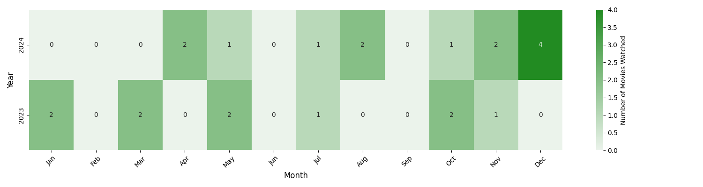

---
layout: default
published : true
title: to be added
permalink: /media/rating/  
hidden : true
--- 

### A simple heatmap showing how many movies I saw 

<h3> Head over to </h3>
- [Watch List for 2024](#WatchList2024)
- [Watch List for 2023](#WatchList2023)

### Pineapple Express 2007
- **Rating**: ★★★★☆ 9
- **Genre**: nonsensical
- **Date** : 4 November 2024
- **Brief Review**: 
        Plot holes, but okay fun to watch
Typical Seth Rogen, on similar topics, still fun

        
        
### Get Hard 2015
- **Rating**: ★★★☆☆ 7
- **Genre**: nonsensical
- **Date** : 4 November 2024
- **Brief Review**: 
        Stereotypical, fun, story is not that captivating
Kevin Hart being a token black guy
        

### White Chicks 2004
- **Rating**: ★★★★☆ 8
- **Genre**: Comedy
- **Date** : 22 October 2024
- **Brief Review**: 
        Amazing, funny, stereotypical
        

### Khosla ka Ghosla 2006
- **Rating**: ★★★★☆ 9
- **Genre**: Coming of Age
- **Date** : 1 August 2024
- **Brief Review**: 
        Amazing, feel good melodrama, coming of age movie
Must watch with family, loved the cinematic shot at 2:01:41
        

### Hum Tum 2004
- **Rating**: ★★☆☆☆ 4
- **Genre**: Drama
- **Date** : 1 August 2024
- **Brief Review**: 
        Meh, one should move on pretty early on
Predictable end, songs make the story seem rushed, else good/bearable
        

### Delhi Belly 2011
- **Rating**: ★★★☆☆ 7
- **Genre**: nonsensical
- **Date** : 5 May 2024
- **Brief Review**: 
        Movie does not make sense, but is fun
        

### Bend It Like Beckham 2002 
- **Rating**: ★★★★☆ 9
- **Genre**: Coming of Age
- **Date** : 18 April 2024
- **Brief Review**: 
        Amazing, fun, feels very indian and open at the same time, has a bit of cliche moments, 
but these are turned happening and exciting. Great watch.
        

### All Quiet on the Western Front 
- **Rating**: ★★★★☆ 8
- **Genre**: War
- **Date** : 17 April 2024
- **Brief Review**: 
        Visually strong, how easily can lives be lost

### Fatherhood Kevin Hart
- **Rating**: ★★★☆☆ 7
- **Genre**: Documentary
- **Date** : 31 October 2023
- **Brief Review**: 
        Cliche, theek hai tho
        Powerful story 

### Uncharted 2022
- **Rating**: ★★☆☆☆ 4
- **Genre**: Action
- **Date** : 30 October 2023
- **Brief Review**: 
        Nothing new, very cliche
        Waste of time

### A Brilliant Young Mind
- **Rating**: ★★★★☆ 8
- **Genre**: Documentary
- **Date** : 17 July 2023
- **Brief Review**: 
        Idk mixed not boring tho, lacks conclusion

### The Boy Who Harnessed The Wind
- **Rating**: ★★★☆☆ 7
- **Genre**: Drama
- **Date** : 5 May 2023
- **Brief Review**: 
        Great movie, talks about parenting  

### The Great Hack 2019
- **Rating**: ★☆☆☆☆ 3
- **Genre**: Drama
- **Date** : 23 March 2023
- **Brief Review**: 
seems like a movie for paraniods, more like a campaign on its own

### Wakanda 2022
- **Rating**: ★☆☆☆☆ 2
- **Genre**: Documentary
- **Date** : 11 March 2023
- **Brief Review**: 
        Have I lost all appreciation of art
No fight sequence alongside very poor transitions, Not enough lighting at times
The art style feels a bit off, especially the goggles
2065 byte encryption bro wtf, Alse there is no such thing as euler angles
The Talokan chant sucks, sounds like Taloker bakery
Tf, ri/rio mentions she built her first machine when she was 3
Wakanda me IIT nai hai kya 💀

### The Theory of Everything
- **Rating**: ★★★★☆ 8
- **Genre**: Documentary
- **Date** : 29 January 2023
- **Brief Review**: 
        Beautiful, wish Jane had more appreciation

### First Man 2018
- **Rating**: ★★★☆☆ 7
- **Genre**: Sci-Fi
- **Date** : 27 January 2023
- **Brief Review**: 
        Great watch, has Ryan Gosling as well